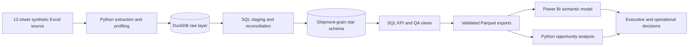

# Logistics Control Tower

**SQL · Python · Power BI portfolio project**

An end-to-end analytics case study that combines transportation, warehouse,
finance, claims, CRM, and survey data at shipment grain. The project turns 12
source tables and 921,177 source rows into a governed star schema, reusable KPI
layer, Power BI semantic-model kit, and quantified operations recommendations.

> **Data notice:** all data is production-like and synthetic. It contains no
> real customers, shipments, people, or company results.

## Executive findings

The included full-size model contains 98,595 live, non-test shipments. Dated
shipments span January 2024 through December 2025; 11,976 shipments have no ship
date and remain visible in unfiltered totals.

| KPI | Result | Why it matters |
|---|---:|---|
| On-time delivery | 76.5% | 59,986 of 78,452 OTD-eligible shipments |
| OTIF | 62.4% | 46,321 of 74,198 OTIF-eligible shipments |
| Revenue | $72.3M | Financial results are reconciled from invoice data |
| Gross margin | $48.3M / 66.8% | Calculated after carrier cost and paid claims |
| Full-fill rate | 81.4% | The 98.7% average fill rate masks partial fills |
| Average CSAT | 3.32 / 5 | Based on 3,320 surveyed shipments, or 3.4% coverage |
| Net promoter score | -18.8 | Directional because survey non-response may be material |

Late shipments are associated with a **2.4x complaint rate**, **1.5x claim rate**,
and a **1.42-point CSAT gap** versus on-time shipments. Among carriers with at
least 1,000 OTD-eligible shipments, StoneBridge Freight has the lowest on-time
rate at 72.7% (2,554 of 3,511). Among lanes with at least 250 OTIF-eligible
shipments, New Jersey Metro to Salt Lake City has the lowest OTIF at 55.6% (229
of 412).

Read the generated [business findings](reports/business_insights.md) for the
rankings, interpretation limits, and 30/60/90-day recommendations.

## What this project demonstrates

- **Python:** deterministic demo-data generation, Excel extraction, type-safe
  identifier handling, profiling, data-quality reporting, atomic outputs,
  orchestration, and pandas-based business analysis.
- **SQL:** layered DuckDB transformations, source-system reconciliation,
  deduplication, window functions, controlled fallback matches, shipment-grain
  aggregations, star-schema modeling, KPI views, and executable quality gates.
- **Power BI:** parameterized Power Query, dimensional relationships, role-playing
  dates, a curated DAX measure catalog, disconnected QA tables, report-page
  specifications, accessibility guidance, and a reusable theme.
- **Analytics communication:** explicit KPI denominators, data-coverage measures,
  cautious association language, opportunity thresholds, and decision-oriented
  recommendations.

## Architecture



The fact table contains one row per final live, non-test shipment. Shipment lines,
tracking events, WMS records, invoices, claims, support tickets, and surveys are
aggregated before joining, which prevents fan-out and double counting. Six
business dimensions—date, customer, carrier, warehouse, service, and lane—filter
the fact with single-direction one-to-many relationships.

See the full [semantic model specification](powerbi/MODEL_SPEC.md).

## Production boundary

This portfolio version intentionally runs as a transparent local full-refresh:
an ordered Python runner invokes each SQL/data-contract step, DuckDB provides
the local warehouse, and CI rebuilds the deterministic demo fixture. That makes
the engineering decisions easy to inspect without pretending this repository is
already a deployed production platform. The concrete next steps for scheduling,
incremental/CDC processing, dbt lineage, and operational observability are
listed in the [production roadmap](documentation/PRODUCTION_ROADMAP.md).

## Business questions

1. Which carriers, warehouses, modes, and lanes have the weakest service?
2. Which warehouse and transportation signals are associated with late delivery?
3. Which customers and lanes have the weakest profitability?
4. How do late and short shipments relate to complaints, claims, CSAT, and NPS?
5. Where can management improve cost and service without relying on misleading
   low-volume rankings?

## Repository guide

| Path | Purpose |
|---|---|
| [`python/`](python/) | Demo generator, extraction/profiling, pipeline runner, exports, and insight generation |
| [`sql/`](sql/) | Staging, reconciliation, star schema, KPI views, validation, and portfolio queries |
| `data/powerbi/` | Refresh-ready fact, dimensions, and disconnected QA Parquet exports. Generated locally by pipeline step 10; not tracked in Git |
| [`powerbi/BUILD_GUIDE.md`](powerbi/BUILD_GUIDE.md) | End-to-end Power BI Desktop authoring instructions |
| [`powerbi/MEASURES.dax`](powerbi/MEASURES.dax) | Curated DAX measure catalog |
| [`powerbi/REPORT_BLUEPRINT.md`](powerbi/REPORT_BLUEPRINT.md) | Seven-page report design and interaction plan |
| [`powerbi/logistics-control-tower-theme.json`](powerbi/logistics-control-tower-theme.json) | Importable Power BI theme |
| [`documentation/data_dictionary.xlsx`](documentation/data_dictionary.xlsx) | Source data dictionary |
| [`documentation/PRODUCTION_ROADMAP.md`](documentation/PRODUCTION_ROADMAP.md) | Explicit path from local case study to scheduled, incremental production platform |
| [`documentation/POWER_BI_VALIDATION.md`](documentation/POWER_BI_VALIDATION.md) | Model, KPI, interaction, accessibility, and performance QA |
| [`documentation/POWER_BI_QA_RESULTS.md`](documentation/POWER_BI_QA_RESULTS.md) | Completed manual interaction, performance, accessibility, and release review |
| [`images/Logistics_Control_Tower.pdf`](images/Logistics_Control_Tower.pdf) | Reviewer-friendly export of the authored seven-page report |
| `images/*.png` | Readable report-page and semantic-model evidence captures |
| [`reports/`](reports/) | Full-size benchmark profiling/results; see [`reports/README.md`](reports/README.md) for demo-vs-benchmark provenance |
| [`tests/`](tests/) | Python unit tests, SQL fixture tests over the real queries, and the end-to-end integration test |

## Reproduce the pipeline

### 1. Create the Python environment

Python 3.11 or newer is supported; the CI workflow exercises Python 3.11,
3.12, and 3.13.

```powershell
py -m venv .venv
.\.venv\Scripts\Activate.ps1
python -m pip install --upgrade pip
python -m pip install -r requirements.txt
```

On macOS or Linux, activate with `source .venv/bin/activate`.

### 2. Choose a data path

To run the included full-size case study, place the synthetic source workbook at
`data/raw/Logistical_Data.xlsx`, then run:

```powershell
python python/run_pipeline.py
```

The source workbook is intentionally ignored by Git. To evaluate the entire
pipeline without it, generate a smaller deterministic workbook and continue
through all steps with one command:

```powershell
python python/run_pipeline.py --generate-demo-data
```

The demo run is isolated: it writes `data/raw/demo/` and `reports/demo/`, so it
does not overwrite the tracked full-size benchmark reports. The demo fixture
contains 7,200 source shipments and will produce different KPI values from the
98,595-shipment benchmark used by the headline findings. Use
`--force-demo-data` only when you intentionally want to replace the existing
isolated demo workbook.

The demo survey fixture uses seeded shipment-level hashes for response selection,
CSAT, NPS, and comments; those values are not functions of delivery delay. This
keeps the fixture useful for testing analytical logic without encoding a desired
customer-satisfaction finding into the input data. Any relationship observed in
the demo is therefore a sample result, while the headline findings require the
separate full-size benchmark workbook described in [`reports/README.md`](reports/README.md).

For targeted development, select an inclusive range of steps:

```powershell
python python/run_pipeline.py --start-at staging --stop-after validate
python python/run_pipeline.py --help
```

The pipeline validates required inputs before work begins, wraps database steps
in transactions, checks semantic-model integrity, reconciles KPI totals, writes
exports atomically, and returns a nonzero exit code when a required step fails.

### 3. Run automated checks

```powershell
python -m unittest discover -s tests -v
python -m pip install -r requirements-dev.txt
python -m ruff check .
```

The suite has three layers, each answering a different question:

| Layer | File | What it proves |
|---|---|---|
| Python unit tests | [`tests/test_python_pipeline.py`](tests/test_python_pipeline.py) | Demo data is deterministic and referentially complete; identifiers keep their text form; table names reject injection-shaped input; transactions roll back; CSV writes are atomic |
| SQL fixture tests | [`tests/test_sql_transforms.py`](tests/test_sql_transforms.py) | Each transformation rule is correct on hand-built adversarial rows: duplicate delivery scans, partial quantity extracts, fallback matching precedence, crosswalk collisions, re-tendered parents, and fan-out from child tables |
| Integration test | [`tests/test_python_pipeline.py`](tests/test_python_pipeline.py) | The twelve pipeline steps run end to end and the finished model passes every critical validation |

The SQL fixture tests execute the real `sql/*.sql` files against a small
in-memory DuckDB database built by [`tests/sql_fixtures.py`](tests/sql_fixtures.py).
Nothing is re-implemented for testing, so a rule can only pass here by being
correct in the query that ships. The same suite asserts that all critical
checks in `07_validate_model.sql` pass on a fixture deliberately loaded with
unmatched invoices, unresolvable customers, missing quantities, voided
shipments, and duplicate scans.

The SQL quality gate can also be reviewed independently in
[`sql/07_validate_model.sql`](sql/07_validate_model.sql). A healthy model returns
`PASS` with a zero failure count for every test.

The GitHub Actions workflow in [`.github/workflows/portfolio-quality.yml`](.github/workflows/portfolio-quality.yml)
lints the code, runs all three test layers, rebuilds the full project from
deterministic demo data, and re-runs the validation gate against the rebuilt
model on every push and pull request.

## Build the Power BI report

The repository includes every authoring asset. Run the pipeline first, which
writes the model inputs to `data/powerbi/`, then:

1. Follow [`powerbi/BUILD_GUIDE.md`](powerbi/BUILD_GUIDE.md).
2. Create the folder parameter and queries from
   [`powerbi/POWER_QUERY.md`](powerbi/POWER_QUERY.md).
3. Build the relationships in [`powerbi/MODEL_SPEC.md`](powerbi/MODEL_SPEC.md).
4. Add the calculated tables/columns and measures from [`powerbi/`](powerbi/).
5. Import the supplied theme and build the pages in the report blueprint.
6. Reconcile the finished report with the disconnected QA exports using the
   Power BI validation checklist.

The authored report is saved locally as `powerbi/Logistics_Control_Tower.pbix`,
but `.pbix` is intentionally ignored because it is a large binary produced by
Power BI Desktop rather than by a script that CI can verify. For a public
portfolio release, attach a reviewed copy of the PBIX or link to a hosted
artifact, and include a PDF plus readable page captures in `images/`. Reviewers
without Power BI Desktop can read the report design in
[`powerbi/REPORT_BLUEPRINT.md`](powerbi/REPORT_BLUEPRINT.md) and the analyzed
numbers in [`reports/`](reports/), which are tracked and regenerated
deterministically by the pipeline.

## Portfolio handoff

- Start with this README, [`reports/business_insights.md`](reports/business_insights.md), and [`powerbi/REPORT_BLUEPRINT.md`](powerbi/REPORT_BLUEPRINT.md) for the business story and report design.
- The local Power BI artifact opens on **Executive Overview** and includes a Data Quality page with KPI eligibility, match-rate, ship-date coverage, missing-ship-date shipment count, and missing-date revenue disclosures.
- A seven-page PDF export is available at [`images/Logistics_Control_Tower.pdf`](images/Logistics_Control_Tower.pdf) for reviewers who do not have Power BI Desktop.
- Readable page evidence is available in [`images/Executive_Overview.png`](images/Executive_Overview.png), [`images/Carrier_Lane_Performance.png`](images/Carrier_Lane_Performance.png), [`images/Profitability.png`](images/Profitability.png), and [`images/Data_Quality_Coverage.png`](images/Data_Quality_Coverage.png). The semantic-model evidence is [`images/Model_View.png`](images/Model_View.png).
- The completed manual review is recorded in [`documentation/POWER_BI_QA_RESULTS.md`](documentation/POWER_BI_QA_RESULTS.md), including the interaction evidence, Performance Analyzer timings, and the explicit accessibility finding.
- The reviewed PBIX is available as the [v1.1.0 GitHub release asset](https://github.com/Akshith597/logistics-control-tower/releases/tag/v1.1.0); it remains out of the source tree because `.pbix` is intentionally ignored.
- The automated gate is [`portfolio-quality.yml`](.github/workflows/portfolio-quality.yml): run `python -m unittest discover -s tests -v` and `python -m ruff check .` locally before publishing.
- The repository is published for portfolio review. The release notes disclose the synthetic-data scope and the QA evidence; the accessibility limitation is documented rather than hidden.

## KPI governance and data quality

- Official service measures use `official_kpi_eligible_flag = TRUE`.
- OTD excludes shipments without a resolved on-time result; OTIF also requires a
  usable shipment fill-rate result. The dashboard displays eligible counts with
  each rate.
- Gross-margin percentage is `SUM(gross margin) / SUM(revenue)`, never an average
  of shipment-level percentages.
- The pipeline records source duplicates, unmatched relationships, missing dates,
  missing quantities, duplicate delivery events, and fallback-match coverage.
- The Power BI Data Quality page keeps customer, carrier, warehouse, invoice,
  WMS, fill-rate, and survey coverage visible to the audience.

The most material source issues in the full dataset are documented in
[`reports/data_quality_issues.csv`](reports/data_quality_issues.csv), including
delivered shipments without a delivery timestamp and records that require
controlled fallback matching.

## Recommended action plan

- **30 days:** assign owners to KPI definitions, missing delivery outcomes, and
  OTIF/fill coverage; publish eligible counts beside service KPIs.
- **60 days:** review high-volume carrier/lane combinations that combine weak OTD,
  low OTIF, claims, and complaints.
- **90 days:** pilot routing-guide or service-level changes and evaluate pre/post
  service, cost, claims, and CSAT before scaling.

These recommendations are analytical hypotheses for a synthetic case study, not
causal conclusions or operating instructions for a real network.
