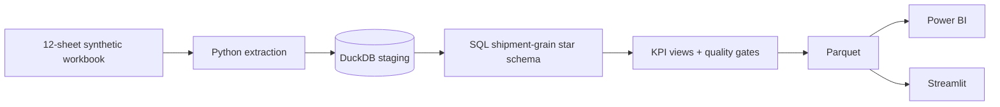

# Logistics Control Tower

**$72.3M in synthetic revenue, but only 76.5% on-time delivery and 62.4% OTIF.**
A logistics analytics case study across 98,595 shipments.

[Live demo](https://logistics-control-tow.streamlit.app/) · [PBIX](https://github.com/Akshith597/logistics-control-tower/releases/download/v1.1.0/Logistics_Control_Tower.pbix) · [Synthetic workbook](https://github.com/Akshith597/logistics-control-tower/releases/download/v1.1.0/Logistical_Data.xlsx)

Child records are aggregated before shipment joins to prevent double counting.

## Three decisions this enables

| Decision | Evidence | Dollar-impact scenario |
|---|---|---|
| Pilot routing changes | 18,466 late shipments | **$46K**: prevent 10% at $25 net benefit each |
| Fix full-fill exceptions | 10,434 on-time underfills | **$26K**: prevent 10% at $25 net benefit each |
| Audit pricing/accessorial recovery | $72.3M billed revenue | **$723K**: recover another 1% with no incremental cost |

Illustrative scenarios, not measured savings or additive forecasts. [Evidence and assumptions](documentation/DECISIONS.md).

## Verify the findings

The screenshot and headline use the full-size synthetic benchmark; its **66.8% margin is optimistic**. The separate live demo reports **$7.85M revenue, 71.4% OTD, 65.9% OTIF**.

[Reproduce, test, and build](documentation/REPRODUCING.md). Benchmark OTD uses 78,452 resolved eligible shipments; OTIF uses 74,198.

[Model](powerbi/MODEL_SPEC.md) · [Dashboard QA](documentation/POWER_BI_QA_RESULTS.md) · [Roadmap](documentation/PRODUCTION_ROADMAP.md) · [MIT](LICENSE)
