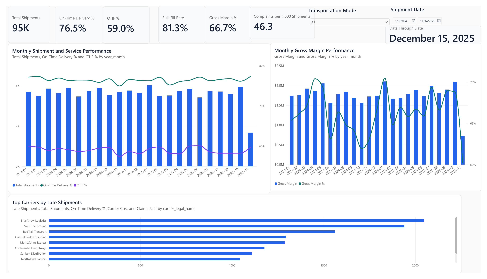
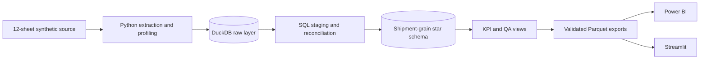
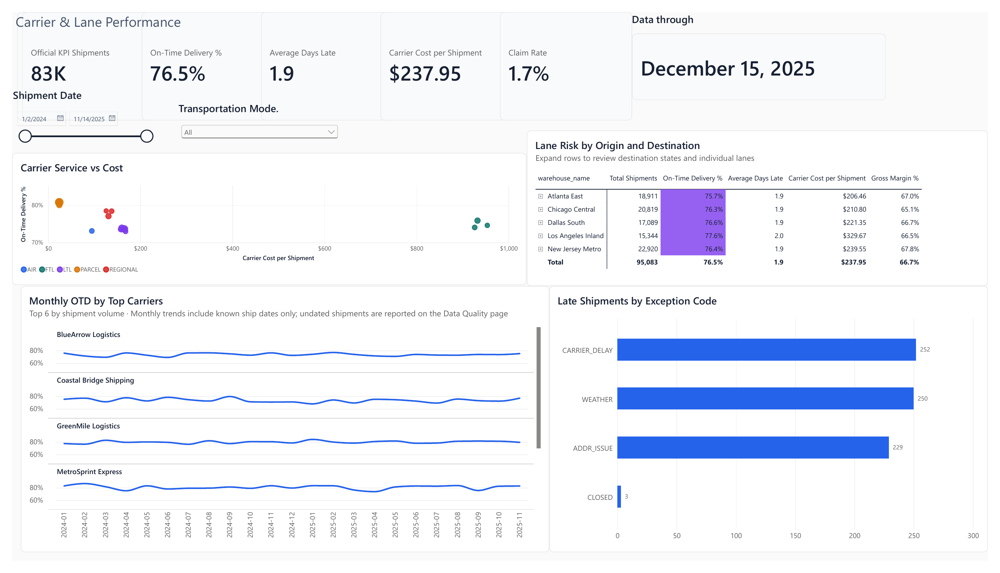
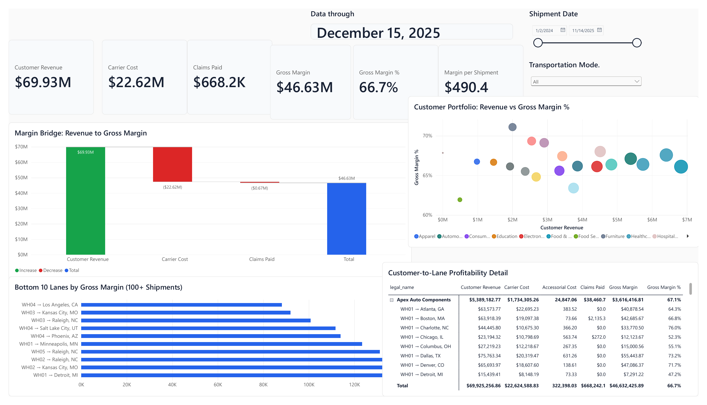
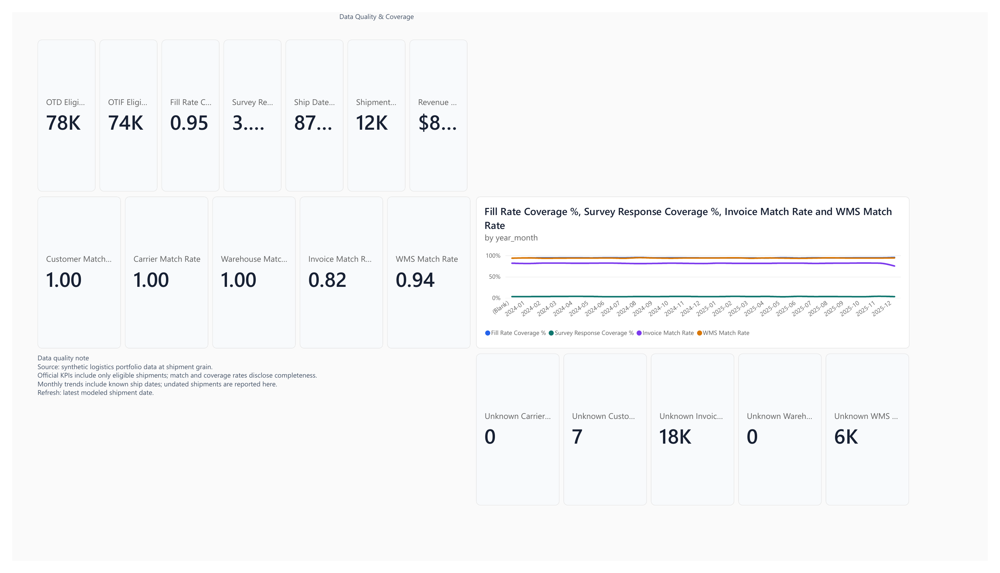

# Logistics Control Tower

[](https://github.com/Akshith597/logistics-control-tower/actions/workflows/portfolio-quality.yml)
[](https://www.python.org/)
[](LICENSE)



An end-to-end logistics analytics case study that turns 12 source tables into a
governed DuckDB star schema, reusable KPI layer, and decision-ready Power BI and
Streamlit dashboards.

[](https://logistics-control-tow.streamlit.app/)
[](https://akshith597.github.io/logistics-control-tower/)
[](https://github.com/Akshith597/logistics-control-tower/releases/latest/download/Logistics_Control_Tower.pbix)

> All data is production-like and synthetic. It contains no real customers,
> shipments, people, or company results.

## Interactive demo scorecard

These values match the tracked synthetic fixture used by the Streamlit app:
6,968 live, non-test shipments dated January 2024 through December 2025. The
downloadable PBIX is the larger benchmark report and is intentionally separate.

| KPI | Result | Decision signal |
|---|---:|---|
| On-time delivery | 71.4% | 4,956 of 6,939 eligible shipments |
| OTIF | 65.9% | 4,574 of 6,939 eligible shipments |
| Revenue | $7.85M | Reconciled from demo invoice data |
| Gross margin | $1.57M / 20.0% | Positive after carrier cost and paid claims |
| Full-fill rate | 92.3% | 6,405 of 6,939 eligible shipments |
| Average CSAT | 2.95 / 5 | 952 synthetic survey responses |
| Net promoter score | -43.2 | Directional synthetic-fixture result |

The larger benchmark model's generated findings remain available in
[business findings](reports/business_insights.md); do not compare those benchmark
figures directly with the interactive demo scorecard above.

## Run it in one command

After creating a Python 3.11+ environment and installing `requirements.txt`:

```bash
python python/run_pipeline.py --generate-demo-data
```

This generates an isolated deterministic workbook, rebuilds the warehouse and
Parquet exports, runs validation, and writes demo reports without overwriting the
tracked benchmark reports. Then launch the browser dashboard:

```bash
streamlit run streamlit_app.py
```

## How it works



The fact table holds one row per final live, non-test shipment. Lines, tracking
events, WMS records, invoices, claims, support tickets, and surveys are
aggregated before joining to prevent fan-out and double counting.

| Layer | What to inspect |
|---|---|
| Python pipeline | [`python/run_pipeline.py`](python/run_pipeline.py) |
| SQL transformations | [`sql/`](sql/) |
| Tests and quality gates | [`tests/`](tests/) and [`sql/07_validate_model.sql`](sql/07_validate_model.sql) |
| Power BI semantic model | [`powerbi/MODEL_SPEC.md`](powerbi/MODEL_SPEC.md) |
| Dashboard build guide | [`powerbi/BUILD_GUIDE.md`](powerbi/BUILD_GUIDE.md) |
| KPI reconciliation | [`reports/executive_summary.csv`](reports/executive_summary.csv) |
| Production roadmap | [`documentation/PRODUCTION_ROADMAP.md`](documentation/PRODUCTION_ROADMAP.md) |

## Design and governance

- **Reliable grain:** every service and financial KPI is calculated at shipment
  grain with explicit eligible denominators.
- **Reproducible inputs:** deterministic demo generation makes CI independent of
  private source files.
- **Visible limitations:** missing dates, survey coverage, fallback matches, and
  other data-quality risks are surfaced rather than silently discarded.
- **Reconciled outputs:** generated CSV targets, executable SQL checks, and Python
  tests keep dashboard values tied to the modeled data.
- **Honest production boundary:** this is a transparent local full-refresh
  portfolio system, with CDC, orchestration, observability, and lineage called
  out as next steps.

For implementation detail, use the [Power BI report blueprint](powerbi/REPORT_BLUEPRINT.md),
[validation protocol](documentation/POWER_BI_VALIDATION.md), and
[QA results](documentation/POWER_BI_QA_RESULTS.md).

## More dashboard views

| Carrier and lane performance | Profitability | Data quality |
|---|---|---|
|  |  |  |

The reviewed dashboard is also available as a
[PDF preview](images/Logistics_Control_Tower.pdf) and downloadable
[Power BI file](https://github.com/Akshith597/logistics-control-tower/releases/latest/download/Logistics_Control_Tower.pbix).

## License

[MIT](LICENSE)
