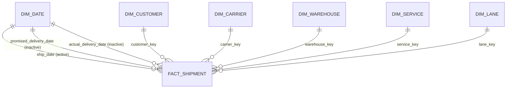

# Power BI Semantic Model Specification

## Model shape

`Fact Shipment` contains one row per final live, non-test shipment. Its unique key is `shipment_key`. All facts from shipment lines, tracking events, WMS records, invoices, claims, CRM tickets, and surveys were collapsed to this grain in SQL before the export.

## Relationships

Create these relationships manually. Every relationship uses single-direction filtering from dimension to fact.

| One side | Column | Many side | Column | Active | Cardinality |
|---|---|---|---|---|---|
| `Dim Date` | `date_key` | `Fact Shipment` | `ship_date` | Yes | One-to-many |
| `Dim Date` | `date_key` | `Fact Shipment` | `promised_delivery_date` | No | One-to-many |
| `Dim Date` | `date_key` | `Fact Shipment` | `actual_delivery_date` | No | One-to-many |
| `Dim Customer` | `customer_key` | `Fact Shipment` | `customer_key` | Yes | One-to-many |
| `Dim Carrier` | `carrier_key` | `Fact Shipment` | `carrier_key` | Yes | One-to-many |
| `Dim Warehouse` | `warehouse_key` | `Fact Shipment` | `warehouse_key` | Yes | One-to-many |
| `Dim Service` | `service_key` | `Fact Shipment` | `service_key` | Yes | One-to-many |
| `Dim Lane` | `lane_key` | `Fact Shipment` | `lane_key` | Yes | One-to-many |

Do not enable bidirectional filtering and do not relate the QA tables. The inactive date relationships are invoked only by measures using `USERELATIONSHIP`.

## Table roles and field visibility

| Table | Grain | Show to report authors | Hide by default |
|---|---|---|---|
| `Fact Shipment` | One row per shipment | Dates, operational flags, status, quantity, service outcomes, financial outcomes, claims, tickets, survey outcomes | All `*_key` foreign keys, duplicated mode/service labels, raw IDs not used for drillthrough |
| `Dim Date` | One row per calendar date | Date hierarchy, year, quarter, month, week, weekday | Numeric sort columns |
| `Dim Customer` | One row per ERP customer plus Unknown | Legal name, DBA name, industry, status, state, volume tier | Customer keys, owner email unless explicitly needed |
| `Dim Carrier` | One row per carrier plus Unknown | Carrier name, SCAC, primary mode, status | Carrier keys |
| `Dim Warehouse` | One row per warehouse plus Unknown | Warehouse name, city, state, capacity, active flag | Warehouse keys and WMS code |
| `Dim Service` | One row per mode and best available service identifier (code, otherwise name) | Mode, service level name/code, typical planned transit days | Service key |
| `Dim Lane` | One row per origin/destination combination | Origin, destination city/state/postal/country | Lane key |
| `QA *` | Pre-aggregated reconciliation grain | Nothing in production report pages | Entire table |
| `_Measures` | Measure container | All curated measures | Placeholder column |
| `KPI Targets` | One row per illustrative KPI target | KPI name when documenting assumptions | Direction/tolerance unless used in a target visual |

## Data types and formats

| Field pattern or example | Power BI type | Format / behavior |
|---|---|---|
| `*_date`, `date_key` | Date | `mmm d, yyyy` |
| `*_ts` | Date/Time | `mmm d, yyyy h:mm AM/PM` |
| `*_flag` | True/False | Do not summarize |
| `*_usd`, revenue, cost, margin | Fixed decimal number | `$#,##0` |
| rates and percentages stored from 0 to 1 | Decimal number | `0.0%` |
| `shipment_nps` and NPS measures | Decimal number | `0.0` |
| counts, quantities, pieces | Whole number when lossless | `#,##0` |
| hours, days, miles, weights | Decimal number | `#,##0.0` |
| IDs, ZIP/postal codes, SCAC | Text | Do not summarize |

## Date behavior

The visible date slicer filters shipments by `ship_date`. Measures named `Delivered Shipments (Actual Date)` and `Promised Shipments (Promised Date)` switch to the appropriate inactive relationship. Label visuals clearly when they use a date role other than shipment creation date.

Use a hierarchy of `year` > `quarter_label` > `month_name` > `date_key`. Do not use Power BI's automatic date/time hierarchy; disable Auto date/time for this file.

`Dim Service[planned_transit_days]` is the rounded median for that service member,
included only as a representative label. Use
`Fact Shipment[planned_transit_days]` for shipment-weighted analysis because
planned time also varies by lane and shipment.

## KPI eligibility rules

- `Total Shipments` includes all rows in the final-live, non-test shipment fact.
- Official service KPIs filter `official_kpi_eligible_flag = TRUE()`.
- On-time delivery excludes rows where `final_on_time_flag` is blank from its denominator.
- OTIF excludes rows where `otif_flag` is blank from its denominator.
- Fill rate averages nonblank shipment-level fill rates for official KPI shipments.
- Full-fill rate counts official shipments with `shipment_fill_rate >= 1` over
  official shipments with a nonblank fill rate; show it beside average fill rate
  because an average can hide many partially filled shipments.
- Average days late includes only official KPI shipments classified as late.
- Financial, complaint, claim, WMS, and survey measures use all fact rows unless the measure name explicitly says otherwise.
- Average CSAT is weighted by `valid_csat_response_count` so only responses with
  a valid 1–5 CSAT score contribute to the shipment-level average. Survey
  coverage still uses `survey_response_count`.

These rules mirror the SQL definitions in `mart.vw_executive_kpis` and prevent a visually plausible but mathematically different dashboard.
